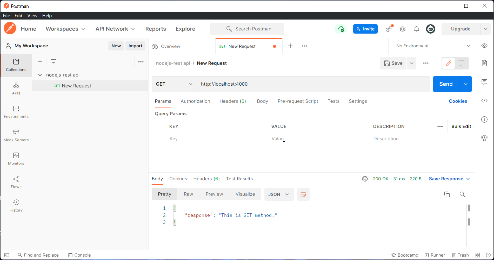
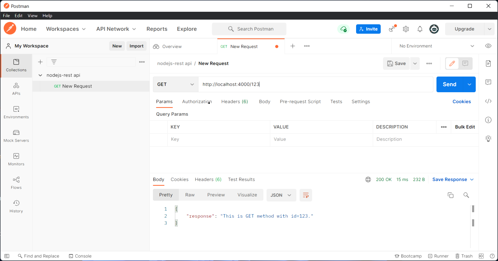
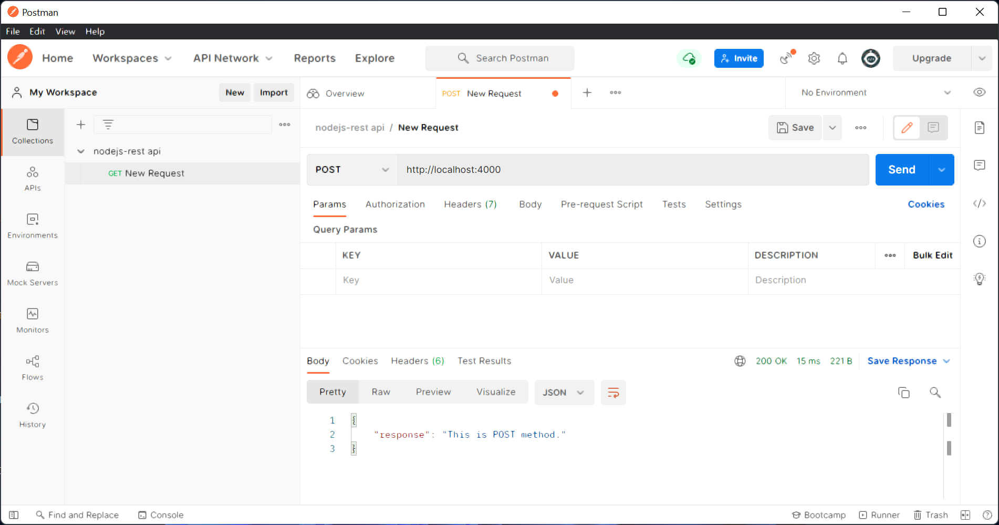

# Node.js REST API

Contoh implementasi REST API dengan Node JS dan Docker. Dengan 5 metode berikut dan mendapat response berbentuk JSON

* GET /
* GET /:id
* POST /
* PUT /
* DELETE /

## Preparation
- create private repo https://github.com/dwimnofan/uts-container-rest-api-119103042
- open terminal/cmd
- clone repo https://github.com/dwimnofan/uts-container-rest-api-119103042
```
git clone https://github.com/dwimnofan/uts-container-rest-api-119103042.git
```
- change directory ke folder repo
```
cd uts-container-rest-api-119103042
```


## 1. Cara Build Container

```
docker build -t nodejs-rest-api-example .
```

## 2. Cara Running Container

Run in default port `4000`:
```
docker run -p 4000:4000 -d nodejs-rest-api-example
```

Run in custom port, e.g., `8080`:
```
docker run -e PORT=8080 -p 8080:8080 -d nodejs-rest-api-example
```

## 3. Test service REST API Dalam container
Tes melalui terminal/cmd

#### GET /
Ketik
```
curl -i http://localhost:4000/
```
Output:
HTTP/1.1 200 OK
X-Powered-By: Express
Content-Type: application/json
Date: Tue, 28 Feb 2017 10:38:31 GMT
Connection: keep-alive
Transfer-Encoding: chunked

{"response":"This is GET method."}


#### GET /:id
Ketik
```
curl -i http://localhost:4000/123
```
HTTP/1.1 200 OK
X-Powered-By: Express
Content-Type: application/json
Date: Tue, 28 Feb 2017 10:39:04 GMT
Connection: keep-alive
Transfer-Encoding: chunked

{"response":"This is GET method with id=123."}


#### POST /
Ketik
```
curl -i -X POST http://localhost:4000
```
Output:
HTTP/1.1 200 OK
X-Powered-By: Express
Content-Type: application/json
Date: Tue, 28 Feb 2017 10:38:47 GMT
Connection: keep-alive
Transfer-Encoding: chunked

{"response":"This is POST method."}


#### PUT /
Ketik
```
curl -i -X PUT http://localhost:4000
```
Output:
HTTP/1.1 200 OK
X-Powered-By: Express
Content-Type: application/json
Date: Tue, 28 Feb 2017 10:40:48 GMT
Connection: keep-alive
Transfer-Encoding: chunked

{"response":"This is PUT method."}


#### DELETE /
Ketik
```
curl -i -X DELETE http://localhost:4000
```
Output:
HTTP/1.1 200 OK
X-Powered-By: Express
Content-Type: application/json
Date: Tue, 28 Feb 2017 10:41:11 GMT
Connection: keep-alive
Transfer-Encoding: chunked

{"response":"This is DELETE method."}


## 4. Test service REST API Luar container
Tes dengan postman

#### GET /


#### GET /:id


#### POST /


#### PUT /


#### DELETE /
